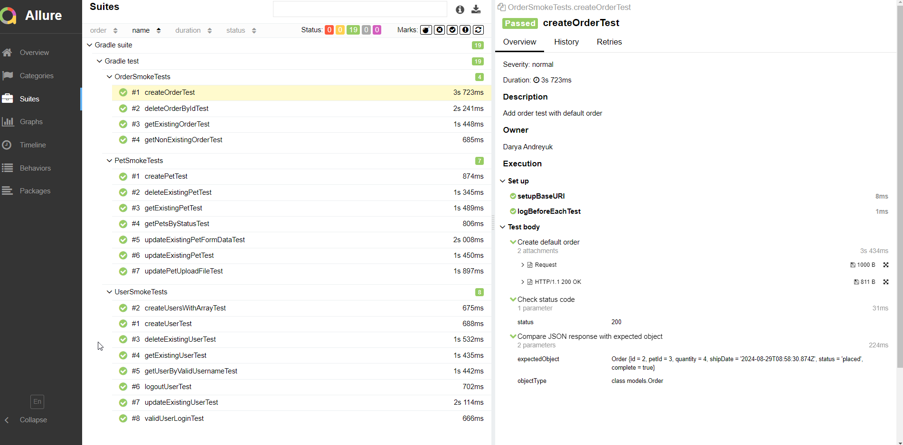
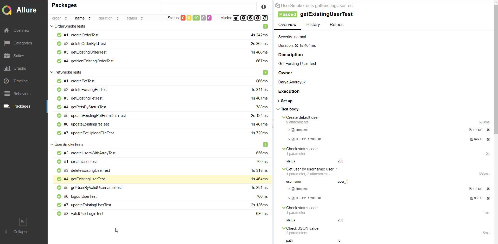

# Pet Store API Automation Testing

## Portfolio project on automation of test scripts using API tests for [Swagger Pet Store](https://petstore.swagger.io/#/)

## Contents:

- [Technology stack used](https://github.com/DaryaAndreyuk/PetStoreAPITesting/tree/fb_DaryaAndreyuk_8_AddReadMe?tab=readme-ov-file#technology-stack-used)
- [Running the Tests from the terminal](https://github.com/DaryaAndreyuk/PetStoreAPITesting/tree/fb_DaryaAndreyuk_8_AddReadMe?tab=readme-ov-file#running-the-tests)
- [Viewing Allure Reports](https://github.com/DaryaAndreyuk/PetStoreAPITesting/tree/fb_DaryaAndreyuk_8_AddReadMe?tab=readme-ov-file#viewing-allure-reports)

## Technology stack used

In this project, automated tests are written in `Java` using the `Rest-Assured` framework for API testing.

- `Gradle` is used as the build tool.
- `TestNG` is the testing framework.
- `Lombok` is utilized to simplify model creation in the API tests.
- `Allure` Rest-Assured listener is applied for generating test reports.

## Running the Tests

To execute the tests, run the following command in the CLI:

`gradlew test`

## Viewing Allure Reports

After running the tests, you can view the Allure reports by executing:

`gradlew allureServe`

## Example of Allure Report

## Report with test results

If you have any comments or suggestions, please feel free to contact me
at: [dasha.andreyuk@gmail.com](dasha.andreyuk@gmail.com)